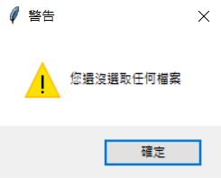
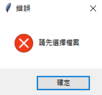

# round_tool
### 使用以下程式庫
1. selenium
2. tkinter
3. shutil
4. time
5. os
# 使用方式
## 使用時需要連接網路
### 選擇一張需要做圓角處理的圖片, 並按下開始, 圓角完的圖片將會位於 rounded 資料夾內
### 若要清除 rounded 請執行 clean_rounded.py
# 螢幕截圖

---

# 範例
## 原圖

## 圓角後

---
## 原圖

## 圓角後

